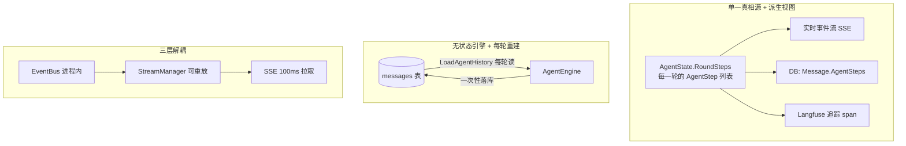

# WeKnora Agent 处理过程记录与前端实时显示（设计参考）

> 本文面向**打算自己实现知识库问答、想参考 Agent 阶段记录与实时渲染方案**的工程师。
> 它回答三个问题：
>
> 1. Agent 每一轮（Think / Act / Observe）的**输入、输出、思考、工具调用**分别记录在哪里、以什么结构记录；
> 2. 这些记录如何变成前端能**实时渲染**的数据；
> 3. **有没有 checkpoint 机制**（结论：Agent 没有，只有数据源同步子系统有）。
>
> 与仓库内既有文档《问答SSE流式传输与前端实时渲染.md》的关系：那份讲「结果如何通过 SSE 出得去、前端如何接得住」，本文讲「**每个阶段具体记录了什么**、前端**怎么把这些记录画成步骤树**」。二者互补，本文聚焦「阶段粒度」。
>
> 代码基准：后端 `internal/agent/`（Go），前端 `frontend/src/`（Vue 3 + TypeScript）。

---

## 目录

1. [核心设计思想（先看这里，可直接借鉴）](#1-核心设计思想)
2. [后端：ReAct 循环与每阶段记录](#2-后端react-循环与每阶段记录)
3. [四条记录通道](#3-四条记录通道)
4. [前端：实时显示](#4-前端实时显示)
5. [历史回放：持久化步骤 → 前端重建](#5-历史回放持久化步骤--前端重建)
6. [可直接借鉴的关键技巧清单](#6-可直接借鉴的关键技巧清单)
7. [checkpoint 结论](#7-checkpoint-结论)
8. [关键文件索引](#8-关键文件索引)

---

## 1. 核心设计思想

WeKnora 的 Agent 是**无状态 ReAct 引擎**（`internal/agent/engine.go:30` 注释明说 "the engine is stateless across turns"）。它围绕三条原则设计，这三条对自研知识库同样成立：



**原则 1 — 单一真相源 + 派生视图**：`AgentState`（含 `RoundSteps []AgentStep`）是内存里的唯一真相；事件流、数据库、追踪系统都是它的**投影**，不各自维护一套独立数据。

**原则 2 — 无状态引擎 + 每轮从 DB 重建**：引擎不缓存历史，每一轮由 caller 调 `LoadAgentHistory` 从 messages 表重读并重建上下文；本轮结束时把 `RoundSteps` 一次性写回 DB。好处：进程重启、多副本部署都无副作用，天然支持断线续传。

**原则 3 — 三层解耦**：LLM 生成 → `EventBus.Emit`（进程内发布订阅）→ `AgentStreamHandler` 翻译成 `StreamEvent` 写入 `StreamManager`（内存或 Redis，append-only）→ SSE handler 以 100ms 定时器**拉取**增量事件推给浏览器。生成方完全不关心连接状态。

---

## 2. 后端：ReAct 循环与每阶段记录

### 2.1 核心数据结构

定义在 `internal/types/agent.go`：

```go
// 一轮 ReAct 迭代的完整记录
type AgentStep struct {
    Iteration        int        `json:"iteration"`        // 第几轮（0 起）
    Thought          string     `json:"thought"`          // Think 阶段的思考文本
    ReasoningContent string     `json:"reasoning_content,omitempty"` // 深度思考 channel（OpenAI 协议）
    ToolCalls        []ToolCall `json:"tool_calls"`       // Act 阶段执行的工具调用（含结果）
    Timestamp        time.Time  `json:"timestamp"`
}

// 单个工具调用
type ToolCall struct {
    ID               string                 `json:"id"`
    Name             string                 `json:"name"`
    Args             map[string]interface{} `json:"args"`
    Result           *ToolResult            `json:"result"`    // 输出/错误/结构化数据/图片
    Reflection       string                 `json:"reflection,omitempty"`
    Duration         int64                  `json:"duration"`  // 执行耗时 ms
    ProviderMetadata ToolCallMetadata       `json:"provider_metadata,omitempty"` // 跨轮重放的 provider 状态
}

// 工具结果
type ToolResult struct {
    Success bool                   `json:"success"`
    Output  string                 `json:"output"`            // 人类可读文本
    Data    map[string]interface{} `json:"data,omitempty"`    // 结构化数据（含 display_type）
    Error   string                 `json:"error,omitempty"`
    Images  []string               `json:"images,omitempty"`
}

// 整轮执行状态（一次 Execute 的汇总）
type AgentState struct {
    CurrentRound  int             `json:"current_round"`
    RoundSteps    []AgentStep     `json:"round_steps"`    // 所有步骤累积
    IsComplete    bool            `json:"is_complete"`
    FinalAnswer   string          `json:"final_answer"`
    KnowledgeRefs []*SearchResult `json:"knowledge_refs"`
    TurnUsage     TokenUsage      `json:"turn_usage"`     // 跨轮累计 token
}
```

> 设计要点：`Thought` 与 `ReasoningContent` 分开存——前者是普通文本思考，后者是模型独立 `reasoning_content` 通道的深度思考（MiMo/DeepSeek 需要，跨轮回放时要原样放回 assistant 消息，见 `agent.go:257-261`）。

### 2.2 阶段流转：每个阶段记录了什么

主循环在 `engine.go` 的 `executeLoop`（`:362`）→ `runReActIteration`（`:468`）。一轮 = Think → Analyze → Act → Observe：

| 阶段 | 输入 | 输出 | 记录到哪里 |
| --- | --- | --- | --- |
| **Think**（调 LLM） | messages（system + 历史 + 当前用户）+ tools | `ChatResponse`（Content/ReasoningContent/ToolCalls/Usage） | ① 流式发 `EventAgentThought` + `EventAgentFinalAnswer` 事件；② 回填 `AgentStep.Thought` / `.ReasoningContent`；③ `TurnUsage.Accumulate`；④ Langfuse round span |
| **Analyze**（判断终止） | `ChatResponse` | 终止判定（自然停止 / 空内容重试 / 继续） | 仅逻辑分支，不额外落盘；自然停止时把答案写到 `state.FinalAnswer` |
| **Act**（执行工具） | `response.ToolCalls` | 每个工具的 `ToolResult` + 耗时 | ① 发 `EventAgentToolCall`（hint）+ `EventAgentToolResult`；② 填 `step.ToolCalls[]`；③ Langfuse `agent.tool.<name>` span |
| **Observe**（回填上下文） | `step` | 追加 assistant+tool 消息到 messages | `state.RoundSteps = append(state.RoundSteps, step)`（`engine.go:664`） |

关键代码点（`engine.go`）：

- 每轮 `step := types.AgentStep{...}`（`:589-596`），`Thought = response.Content`、`ReasoningContent = response.ReasoningContent`。
- `step` 创建后先判断 `ctx.Err()`（用户点了停止）：若取消，把**部分思考保留为一个 step** 再 break，不让半截思考污染最终答案（`:608-615`）。
- 自然停止路径：`analyzeResponse`（`:211` 在 observe.go）返回 `isDone`，`state.FinalAnswer = verdict.finalAnswer`。

### 2.3 思考（Thinking）的三层记录

思考是记录最细的部分，分三层（`think.go` 的 `streamThinkingToEventBus` `:161`）：

1. **实时流式**：`emitThought`（`:199`）把思考文本按 chunk 发 `EventAgentThought`，带 `Done` 标记；前端据此画「思考中 → 思考完成」的折叠卡片。
2. **结构化落库**：`AgentStep.Thought`（普通文本）+ `AgentStep.ReasoningContent`（深度思考 channel），随 `AgentSteps` 进 DB。
3. **内联 `<think>` 处理**：某些模型（DeepSeek/Qwen）把思考写进 content 里，用 `ThinkStreamSplitter` 切分，思考进 thought 区、正文进 answer 区；`StripThinkBlocks`（`agenttools`）在最终答案里剥掉这些标签。

关键约束：**思考文本绝不进最终答案**。`think.go:224` 的 `emitAnswer` 与 `emitThought` 严格分流，后端 `agent_stream_handler.go` 也把 answer 与 thinking 作为两条独立 SSE 流。

### 2.4 工具调用的完整生命周期

`act.go` 的 `runToolCall`（`:356`）覆盖一个工具从发起到落盘的每个节点：

```text
runToolCall:
  1. 归一化 ID        NormalizeToolCallID
  2. 解析/修复参数    json.Unmarshal + RepairJSON（坏了也尽量救回来）
  3. 发 hint 事件     EventAgentToolCall（formatToolHint，给 UI 显示「搜索网页("query")」）
  4. 开 Langfuse span agent.tool.<name>（敏感参数如 SQL 被 redact）
  5. 执行             registry.ExecuteTool（带 execTimeout）
  6. 计算耗时         Duration
  7. 构造 ToolCall    {ID, Name, Args, Result, Duration, ProviderMetadata}
  8. 结束 span        finishToolSpan（成功/失败/输出预览/耗时）
  9. 发 result 事件   EventAgentToolResult（含 display_type + 清洗后的 Data）
```

并行工具：`executeToolCallsParallel`（`:242`）用 errgroup 并发执行，结果按原始顺序回填（保证 `step.ToolCalls` 顺序稳定）。

---

## 3. 四条记录通道

同一份 `AgentState` 数据，通过四条通道对外：

### 通道 A：内存态（AgentState）— 唯一真相

就是第 2.1 节的结构，随 `Execute` 的生命周期存在，是所有下游的数据源。

### 通道 B：事件流（EventBus → StreamManager → SSE）

- **EventBus**（`internal/event/event.go`）是进程内发布订阅，事件类型见 `event.go:52-57`：`thought / tool_call / tool_result / reflection / references / final_answer`。
- **AgentStreamHandler**（`internal/handler/session/agent_stream_handler.go`）订阅 EventBus，把每种事件翻译成 `StreamEvent` 写入 StreamManager。事件数据结构在 `internal/event/event_data.go`（`AgentThoughtData:153`、`AgentToolCallData:160`、`AgentToolResultData:169`、`AgentFinalAnswerData:194`、`AgentCompleteData:136`）。
- **StreamManager** 是 append-only 接口（内存 / Redis 实现），key 为 `(sessionID, messageID)`，支持按 offset 增量读、断线重放。
- **SSE 推送**（`stream.go`）以 100ms 定时器拉取增量事件，`c.SSEvent("message", StreamResponse)` + `Flush()`。

### 通道 C：持久化（Message.AgentSteps）

- 完成时 `emitCompletionEvent`（`finalize.go:187`）发 `EventAgentComplete`，携带 `AgentSteps: state.RoundSteps`、`Usage`、`TotalSteps`、`TotalDurationMs`。
- `AgentStreamHandler.handleComplete`（`agent_stream_handler.go:614`）把它写进 `assistantMessage.AgentSteps`（`:642-647`），连同 `Content` / `Usage` / `AgentDurationMs` / `KnowledgeReferences` 由 caller 的 defer 落库。
- 存储类型：`Message.AgentSteps` 是 JSONB 列（`internal/types/message.go:270`），`AgentSteps = []AgentStep`（`:364`）。

> **关键取舍**：`Message.AgentSteps` **只用于历史展示，不进入下一轮 LLM context**（`message.go:266-270` 注释）。跨轮上下文由 `LoadAgentHistory` 从 `AgentSteps` 重新**展开**成 OpenAI 格式的 assistant+tool 消息，而不是把 `AgentSteps` 原样塞给模型。

### 通道 D：Langfuse / OTLP 分布式追踪

`internal/tracing/langfuse/manager.go:33`：OpenTelemetry SDK + OTLP/HTTP exporter 推到 Langfuse v3+/LiteFuse。span 层级：

```text
trace → agent.execute (engine.go:238)
        → agent.round.N  (engine.go:483)   — 每轮一个，含 finish_reason/content_len/token usage/duration
            → agent.tool.<name> (act.go:448) — 含 model_arguments/resolved_arguments/输出预览/耗时
```

敏感参数（如 `database_query` 的 SQL）在 `buildToolSpanInput`（`act.go:69`）被 redact。Langfuse 禁用时整个是 no-op（nil receiver 容忍），不影响主流程。

---

## 4. 前端：实时显示

前端消费 SSE，核心是**两条累积 Map + 一个事件流数组**。

### 4.1 分发中枢 `processStreamChunk`

`frontend/src/composables/useChatStreamHandler.ts:897`。每个 SSE 消息经 `JSON.parse` 后进来，先处理特例，再决定走 Agent 分支还是非 Agent 分支：

```text
processStreamChunk(data):
  ├─ agent_query     → 建/续接 assistant 占位消息
  ├─ references      → applyKnowledgeReferences()
  ├─ memory_recalled → applyUsedMemories()
  ├─ 判断 shouldHandleAsAgent（thinking/tool_call/tool_result/reflection/artifacts_pending，
  │    或 answer/complete 且会话是 agent 模式）
  │    └─ true → handleAgentChunk(data)
  └─ false → 非-Agent：fullContent 累积 + <think> 解析 → updateAssistantSession
```

### 4.2 Agent 模式逐事件累积 `handleAgentChunk`

`handleAgentChunk`（`:504`）用 `switch(responseType)` 把每个事件累积到一个响应式 `message.agentEventStream` 数组：

| response_type | 前端处理（`:554-892`） |
| --- | --- |
| `thinking` | 按 `event_id` 找/建事件，累积 `content`；`done` 时算 `duration_ms`（`:555`） |
| `tool_call` | 按 `tool_call_id` 建 pending 卡片；**并把之前已流的 answer 标记 `superseded`（回撤）**（`:668-683`） |
| `tool_result`/`error` | 匹配 pending 调用，填 `output/error/duration/display_type/tool_data`（`:732`） |
| `answer` | 按 `event_id` 累积；`recomposeAgentAnswer` 重算 `message.content`（`:801`） |
| `complete` | 标记完成 + hydrate artifacts/usage（`:847`） |
| `stop` | 标记完成（`:876`） |

**两条关键 Map**（挂在 message 上，非响应式，用 `markRaw` 避免 Vue 深度代理）：

- `_eventMap`：`event_id → event`，O(1) 定位 thinking/answer 事件做增量累积。
- `_pendingToolCalls`：`tool_call_id → tool_call event`，把迟到的 `tool_result` 关联回 `tool_call`。

### 4.3 渲染组件 `AgentStreamDisplay.vue`

`frontend/src/views/chat/components/AgentStreamDisplay.vue` 遍历 `message.agentEventStream`，渲染成**可折叠的步骤树**：

- **思考卡片合并**：`buildFullEventList`（`:1777`）把相邻的 thinking 事件合并成一张卡；连续 thinking 去重（同一文本不重复显示）。
- **superseded 回撤**：被回撤的 answer（工具轮的前导白）折叠进当轮 thinking 卡片的 **title**（`:1846-1867`），思考作 body，一轮一张卡。
- **promoted thinking**：若 Agent 自然停止且没有 answer 事件，把末尾 thinking 提升为虚拟 answer 卡（带复制/加入知识库工具栏），同时从树里隐藏原 thinking（`hiddenThinkingEventIds` `:1893`）。
- **工具富卡片**：非 thinking 工具调用按 `display_type` 分发到 `ToolResultRenderer.vue`，落到 `tool-results/*.vue` 专用渲染器（搜索结果 / 网页 / grep / 知识图谱 / plan / shell 终端等）。
- **步骤树折叠**：会话结束后中间步骤折叠成一行摘要「N 轮思考 · M 次工具 · 耗时」，点击展开（`shouldShowCollapsedSteps` `:1726`）。

**display_type 双轨机制**（见《问答SSE流式传输与前端实时渲染.md》第 8 节）：`display_type` 既是前端「怎么画」的契约，也是后端「存什么/传什么」的裁剪开关（`persist.go` 的 `ShouldOmitRawToolOutput` / `compactToolSummary`）。

### 4.4 打字机平滑

`AgentStreamDisplay.vue` 用 `useTypewriter`（`:1498`）把流式到达的 answer 文本平滑成稳定打字机节奏；历史加载已完成的答案直接全量显示，不回放。

---

## 5. 历史回放：持久化步骤 → 前端重建

这是「后端记录 → 前端显示」闭环里容易被忽略、但最值得借鉴的一环。

- **后端重建 LLM 上下文**：`LoadAgentHistory`（`service/agent_history.go:50`）读 DB，`buildAssistantHistoryMessages`（`:144`）把 `AgentSteps` 展开成 `assistant(带 tool_calls)` + `tool` 消息序列，过滤掉 pipeline 合成调用（`PipelineToolCallIDPrefix`）和旧版 `final_answer` 工具（`filterNonTerminalToolCalls` `:201`）。

- **前端重建展示事件流**：`reconstructEventStreamFromSteps`（`useChatStreamHandler.ts:285`）反向操作——把 DB 里的 `agent_steps` 还原成 `agentEventStream`：

```text
DB agent_steps（后端落库的结构）           前端 agentEventStream（渲染用的事件流）
  step.reasoning_content      ──►  { type:'thinking', content, done:true }
  step.thought (有工具调用时)  ──►  { type:'answer', superseded:true }   ← 前导白，折叠进标题
  step.tool_calls[i]           ──►  { type:'tool_call', tool_name, arguments,
                                      output, duration, display_type, tool_data }
  message.content             ──►  { type:'answer', content, done:true }
  agent_duration_ms           ──►  { type:'agent_complete', total_duration_ms }
```

> **借鉴点**：后端存「结构化步骤」、前端渲染「事件流」是两种不同的数据形态，中间靠两个**对称的转换函数**（后端 `buildAssistantHistoryMessages` 展开 / 前端 `reconstructEventStreamFromSteps` 还原）衔接。历史消息打开时无需重新流式播放，直接由结构化步骤重建出与实时一致的时间线。

---

## 6. 可直接借鉴的关键技巧清单

| 技巧 | 说明 | 位置 |
| --- | --- | --- |
| **单一真相源** | 所有记录都从 `AgentState.RoundSteps` 派生，不重复维护 | `types/agent.go` |
| **无状态引擎** | 每轮从 DB 重建历史，进程重启/多副本无副作用 | `engine.go:30` |
| **event_id Map 累积** | 前端 O(1) 定位流式事件，避免数组线性查找 | `useChatStreamHandler.ts` |
| **tool_call_id 关联** | 把 tool_result 关联回 tool_call | `useChatStreamHandler.ts` |
| **superseded 回撤** | 前导白（"让我先搜索…"）在发现要调工具后从答案区撤回，折叠进步骤 | 后端 `agent_stream_handler.go:179` + 前端 `:668` |
| **三层解耦 + 100ms 拉取** | EventBus→StreamManager→SSE，生成与推送解耦，天然支持断线续传 | `stream.go` |
| **思考与答案分流** | thinking 与 answer 两条独立流，思考绝不进最终答案 | `think.go` |
| **display_type 双轨** | 一个字符串同时驱动前端渲染 + 后端裁剪 | `persist.go` |
| **对称转换函数** | 结构化步骤 ↔ 事件流的两个反向转换 | `agent_history.go` / `useChatStreamHandler.ts:285` |
| **敏感参数 redact** | Langfuse 里 SQL 等敏感参数只留 key | `act.go:69` |
| **空响应/卡死防护** | 空内容重试、重复内容卡死检测 | `engine.go` |
| **token 预算压缩** | 逼近窗口上限时压缩历史工具结果、保留 call/result 配对 | `observe.go:29` |

---

## 7. checkpoint 结论

**Agent 处理过程没有 checkpoint 机制。**

- 引擎无状态，历史每轮从 DB 重建；中断语义是 **salvage（用已有工具结果拼最终答案）** 而非 **resume（从断点续跑）**：`engine.go:399-411` 在 `ctx.Done()` 时若有工具结果就现场合成最终答案。
- Agent 的持久化粒度是「**整轮完成后一次性落库** `Message.AgentSteps`」，没有「每步保存中间状态以便从某轮继续」的 checkpoint 落盘。

**checkpoint 只存在于数据源同步子系统**，与 Agent 无关：

- `internal/datasource/connector.go:66-74` 定义 `StreamingConnector.Checkpoint(ctx, cursor)`，持久化同步游标。
- 目前只有 **Feishu/Lark、GitLab** 连接器实现，每处理 50 节点或 30 秒落盘一次游标（`datasource_service.go:1008`），目的是 Asynq 任务超时后从断点**续传**而非重来。

| 维度 | Agent 处理过程 | 数据源同步 |
| --- | --- | --- |
| 记录什么 | 每轮的输入/输出/思考/工具调用 | 同步游标 cursor |
| 记录方式 | 4 通道并行（内存态+事件流+DB+追踪） | 周期落盘 checkpoint |
| 中断语义 | salvage（拼答案） | resume（续传） |
| 持久化粒度 | 整轮一次性落库 | 每 50 节点 / 30s 增量 |

---

## 8. 关键文件索引

| 关注点 | 文件 |
| --- | --- |
| 引擎主循环（Execute/executeLoop/迭代） | `internal/agent/engine.go` |
| Think 阶段（LLM 流式 + 思考分流） | `internal/agent/think.go` |
| Act 阶段（工具执行 + 生命周期记录） | `internal/agent/act.go` |
| Observe/上下文窗口管理 | `internal/agent/observe.go` |
| 最终答案合成 + 完成事件 | `internal/agent/finalize.go` |
| 核心数据结构 | `internal/types/agent.go`、`internal/types/message.go` |
| 事件定义 + 事件数据 | `internal/event/event.go`、`internal/event/event_data.go` |
| EventBus→SSE 翻译 | `internal/handler/session/agent_stream_handler.go` |
| 跨轮历史重建 | `internal/application/service/agent_history.go` |
| Langfuse 追踪 | `internal/tracing/langfuse/manager.go` |
| 前端分发中枢 + 历史重建 | `frontend/src/composables/useChatStreamHandler.ts` |
| 前端步骤树渲染 | `frontend/src/views/chat/components/AgentStreamDisplay.vue` |
| 工具结果专用渲染器 | `frontend/src/views/chat/components/tool-results/*.vue` |

---

## 附：给自己实现落地的最小建议

如果你要复刻这套机制，最小闭环只需三件东西：

1. **一个 `AgentStep` 结构**（`iteration / thought / reasoning / tool_calls[]`），每轮填充后 append 到一个 `steps[]` 数组。
2. **一套事件流**（thinking / tool_call / tool_result / answer / complete），每产生一步就发一条，前端按 `event_id`/`tool_call_id` 两个 Map 累积。
3. **两个对称转换函数**：后端「步骤 → LLM 消息」用于下一轮上下文，前端「步骤 → 事件流」用于历史回放。

以上三点落地后，实时显示、历史重放、多轮上下文就都打通了；checkpoint/断点续跑则按需决定是否引入（单次问答场景通常不需要）。
