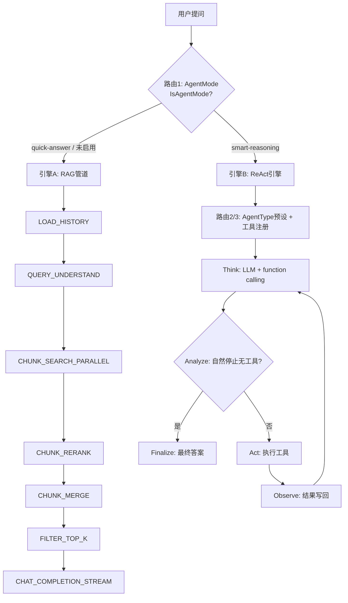
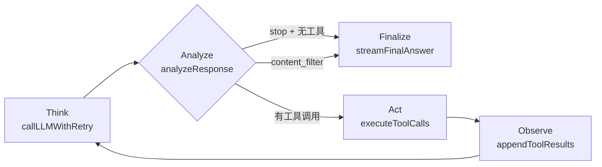
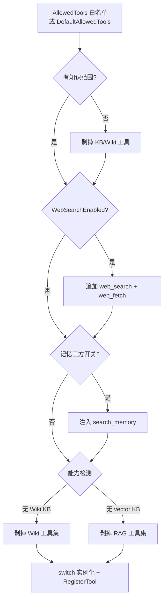

# Agent 编排节点与路由详解

> 本文回答一个问题：**WeKnora 的「Agent」是怎么编排的？节点有哪些、路由怎么走？**
>
> 先说结论：WeKnora 没有用 LangGraph / LangChain 式的「图（Graph）」框架——没有显式的节点对象、边、条件边。它的编排是**两套硬编码的引擎**，加**四层路由**决定「用户这一问走哪套、拿哪些工具」。
>
> 代码基准：`internal/agent/`（ReAct 引擎）、`internal/agent/tools/`（工具注册表）、`internal/application/service/chat_pipeline/`（RAG 管道）、`internal/application/service/agent_service.go`（工具路由）、`internal/handler/session/qa.go`（顶层分发）、`internal/types/custom_agent.go` + `config/builtin_agents.yaml` + `config/agent_type_presets.yaml`（内置 Agent 目录与预设）。

---

## 目录

1. [一句话总览：两套引擎 + 四层路由](#1-一句话总览两套引擎--四层路由)
2. [两套编排引擎](#2-两套编排引擎)
3. [四层路由](#3-四层路由)
4. [ReAct 引擎的五个节点](#4-react-引擎的五个节点)
5. [工具全景与工具路由](#5-工具全景与工具路由)
6. [内置 Agent 目录与预设](#6-内置-agent-目录与预设)
7. [编排流程图](#7-编排流程图)
8. [关键设计权衡](#8-关键设计权衡)
9. [关键文件索引](#9-关键文件索引)

---

## 1. 一句话总览：两套引擎 + 四层路由

```text
用户提问
   │
   ▼
【路由 1】AgentMode 分发（qa.go:844）
   ├── quick-answer ──► 引擎 A：RAG 管道（chat_pipeline，事件链）
   │                     节点：LOAD_HISTORY → QUERY_UNDERSTAND → CHUNK_SEARCH_PARALLEL
   │                           → CHUNK_RERANK → CHUNK_MERGE → FILTER_TOP_K
   │                           → DATA_ANALYSIS → INTO_CHAT_MESSAGE → CHAT_COMPLETION_STREAM
   │
   └── smart-reasoning ─► 引擎 B：ReAct 引擎（internal/agent，循环）
                          节点：Think → Analyze → Act → Observe →（循环）→ Finalize

【路由 2】AgentType 预设（agent_type_presets.yaml）
   决定系统提示词模板 + 默认工具白名单 + KB 兼容性

【路由 3】工具注册路由（agent_service.go registerTools）
   AllowedTools 白名单 ──► 能力检测（KB/Web/Memory）──► 硬安全网过滤 ──► 注册

【路由 4】运行时工具路由（LLM function calling）
   模型在 ReAct 循环里自主决定调用哪个工具
```

关键认知：**「节点」在两套引擎里的含义不同**。

- RAG 管道里，节点是**固定的事件链**（`Pipeline` map 里声明的一段字符串序列，`chat_manage.go`），每个事件对应一个插件，线性执行、条件插入；
- ReAct 引擎里，节点是**同一个函数循环里的四个阶段**（`engine.go` 的 `runReActIteration`），没有图结构，靠 `iterOutcome` 哨兵值控制 continue/break。

---

## 2. 两套编排引擎

| 维度 | 引擎 A：Quick-Answer（RAG 管道） | 引擎 B：Smart-Reasoning（ReAct） |
| --- | --- | --- |
| 入口 | `sessionService.KnowledgeQA` → `chat_pipeline` | `sessionService.AgentQA` → `AgentEngine.Execute` |
| 编排形态 | 事件驱动的 `Pipeline` 链（声明式） | `executeLoop` 硬编码循环（命令式） |
| 是否调工具 | 否（检索是管道内部步骤，不走 function calling） | 是（LLM 通过 function calling 选工具） |
| 节点 | 9 个插件（§2.1） | 5 个阶段（§4） |
| 迭代 | 单次 | 最多 `MaxIterations` 轮 |
| 关键文件 | `chat_pipeline/*.go` | `agent/{engine,think,act,observe,finalize}.go` |
| 适用 | 快速、可预测的 RAG 问答 | 多步推理、跨工具编排 |

### 2.1 RAG 管道的节点（`chat_manage.go` 的 `Pipeline` map）

`internal/types/chat_manage.go` 里声明了管道模板，`session_knowledge_qa.go` 按「是否有检索范围 / 是否开网页搜索」动态组装（`AddIf(hasHistory, ...)` 等条件插入）：

| 节点（事件） | 插件 | 作用 |
| --- | --- | --- |
| `LOAD_HISTORY` | `load_history.go` | 加载多轮历史（`MaxRounds` 轮数截断） |
| `MEMORY_RECALL` | `memory_recall.go` | 召回长期记忆注入 prompt |
| `QUERY_UNDERSTAND` | `query_understand.go` | 意图识别 + 查询改写（指代消解） |
| `CHUNK_SEARCH_PARALLEL` | `search.go` | 向量 + 关键词并行检索 |
| `CHUNK_RERANK` | `rerank.go` | 重排 |
| `CHUNK_MERGE` | `merge.go` | 合并 + 父块展开 + FAQ 快路径 |
| `FILTER_TOP_K` | `filter.go` | 截断 top-k |
| `DATA_ANALYSIS` | `data_analysis.go` | 可选：CSV/Excel 的 DuckDB SQL 分析 |
| `INTO_CHAT_MESSAGE` | `into_chat_message.go` | 组装最终上下文 |
| `CHAT_COMPLETION_STREAM` | `completion.go` | 流式 LLM 生成 |

> 这条链的细节见已有文档《问题检索与QA回答流程》《检索质量深度剖析》《多轮对话与用户记忆机制》，本文不再展开，聚焦 Agent（ReAct）这一侧。

### 2.2 ReAct 引擎的循环结构

`AgentEngine.executeLoop`（`engine.go:362`）→ `runReActIteration`（`engine.go:468`）每轮做四件事（对应注释里的 `1. Think → 2. Analyze → 3. Act → 4. Observe`），用 `iterOutcome` 哨兵（`next`/`continue`/`break`）控制循环：

```text
executeLoop
  └─ for CurrentRound < MaxIterations:
       ├─ manageContextWindow        （上下文窗口管理：压缩/整合）
       ├─ callLLMWithRetry           （Think：带 function calling 的 LLM 流）
       ├─ analyzeResponse            （Analyze：判断是否自然结束）
       │     ├─ 自然停止无工具调用 ──► break（最终答案）
       │     ├─ content_filter ──► break
       │     └─ 有工具调用 ──► 继续
       ├─ executeToolCalls           （Act：执行工具，可并行）
       └─ appendToolResults          （Observe：工具结果写回消息）
  └─ 循环耗尽 → handleMaxIterations → streamFinalAnswerToEventBus（Finalize）
```

**结束条件（Analyze 节点判定，`observe.go:211`）**：没有专门的 `final_answer` 工具——Agent 只通过「**自然停止 + 无工具调用 + 纯文本回答**」结束。任何仍请求工具的轮次都是非终结轮。

### 2.3 两套引擎：共享底层、不共享编排

一个常被问的问题：**smart-reasoning 问答时，会不会调用 quick-answer 的那套检索逻辑？**

答案分两层——**共享的是「底层 service」，不共享的是「上层编排」**。

#### 共享的底层（同一批 service，答案质量机制等价）

`knowledge_search` 工具内部重跑的检索流程，和 quick-answer 的 `search.go` / `rerank.go` 插件调的是**同一批底层服务**：

| 环节 | quick-answer（chat_pipeline 插件） | smart-reasoning（knowledge_search 工具内部） |
| --- | --- | --- |
| 混合检索 + RRF | `search.go:479/561` `knowledgeBaseService.HybridSearch` | `knowledge_search.go:543/582` `knowledgeBaseService.HybridSearch` |
| 重排 | `rerank.go:345` `rerankModel.Rerank` | `knowledge_search.go:693` `rerankModel.Rerank` |
| MMR 去冗余 | `rerank.go:223` `applyMMR(λ=0.7)` | `knowledge_search.go:336` `applyMMR(λ=0.7)` |
| 父块展开 / FAQ 快路径 / 图片富化 | `merge.go` `resolveParentChunks` | `knowledge_search.go:374` + `knowledgebase_search_results.go` `collectEnrichmentChunkIDs` |
| DuckDB 分析 | `data_analysis.go` | `data_analysis` 工具（共享 `s.duckdb`） |

其中重排模型是**同一个实例**：`session_agent_qa.go` 里 `agentRequiresRerankModel` 解析出的 `rerankModel`，既喂给 quick-answer 管道，也通过 `registerTools` 的 `NewKnowledgeSearchTool(..., rerankModel, ...)` 喂给工具。所以混合检索、RRF、重排、MMR、父块这套质量机制，两种模式完全同源。

#### 不共享的编排（各自独立实现）

- **quick-answer**：事件驱动的 `chat_pipeline` 链（§2.1），固定串行，**每次必检索一次**，检索结果经 `CHUNK_MERGE` 组装后直接进 `INTO_CHAT_MESSAGE`。
- **smart-reasoning**：ReAct 循环（§2.2）。`knowledge_search` 工具把「检索 → 去重 → 重排 → MMR → 格式化」在 `Execute` 里**重新实现了一遍**，而不是去调 pipeline 插件。检索由 LLM 决定**按需调用**，可能 0 次、1 次、多次。

#### 三个语义差异

1. **意图识别 / 查询改写**：quick-answer 有独立的 `QUERY_UNDERSTAND` 插件（LLM 意图分类 + 指代消解），改写后的 query 才进检索；smart-reasoning **没有这个阶段**，而是 LLM 直接在 `knowledge_search` 的 `queries` 参数里写检索问句——「查询改写」等价地由 LLM 在函数调用参数里完成。
2. **触发时机**：quick-answer 固定串行、必检索；smart-reasoning 按需调用，且可多轮（`seenChunks` 去重机制专为「同一会话内反复调用不重复吐 token」设计，`knowledge_search.go:967`）。
3. **历史加载**：`LOAD_HISTORY`（轮数截断回放）vs `LoadAgentHistory`。

> 一句话：**smart-reasoning 的检索是「复用底层 service、重写编排」，不是「调用 quick-answer 管道」。** 检索质量机制同源（同一个 `HybridSearch` / `Rerank` / MMR），区别只在上层——固定管道串行 vs LLM 按需调工具、工具内部重跑。

---

## 3. 四层路由

### 3.1 路由 1：AgentMode 分发（`qa.go:844-877`）

这是最顶层的路由，决定走哪套引擎。优先级：**`customAgent.IsAgentMode()` > `request.AgentEnabled`**：

```go
agentModeEnabled := request.AgentEnabled
if reqCtx.customAgent != nil {
    agentModeEnabled = reqCtx.customAgent.IsAgentMode()  // AgentMode == "smart-reasoning"
}
if agentModeEnabled {
    h.executeQA(reqCtx, qaModeAgent, true)    // → sessionService.AgentQA → 引擎 B
} else {
    h.executeQA(reqCtx, qaModeNormal, ...)    // → KnowledgeQA 管道 → 引擎 A
}
```

- `IsAgentMode()`（`custom_agent.go:548`）= `Config.AgentMode == "smart-reasoning"`。
- 一个 sanity gate：`agentModeEnabled && customAgent == nil` 直接 400，避免前端传了 `agent_enabled=true` 但 `agent_id` 丢失导致深层报错。
- `qaMode` 只有两个值：`qaModeNormal`（RAG / 纯聊天）、`qaModeAgent`（工具调用）。

> **关键边界：AgentMode 是「用户选择」，不是「LLM 判断」。**
>
> `AgentMode` 是 `custom_agents` 表里 `config.agent_mode` 的静态字段，用户在前端创建/选择 Agent 时写死；运行时只读字段路由，没有任何模型参与。两个来源（`request.AgentEnabled` 请求开关、`customAgent.Config.AgentMode` 记录配置）都是「人」的决定——模型从不输出「走哪套引擎」。

「人选择 vs LLM 判断」的分界：

| 层级 | 谁决定 | 判断什么 | 代码 |
| --- | --- | --- | --- |
| **模式**（quick-answer vs smart-reasoning） | **用户**（静态配置） | 走哪套引擎 | `qa.go:844` |
| **意图**（quick-answer 内部） | **LLM** | 这一问是闲聊还是需要检索（`kb_search` / 拒答等） | `query_understand.go:120` |
| **工具调用**（smart-reasoning 内部） | **LLM** | 调哪些工具、调几次、何时结束 | ReAct 循环的 function calling |

> 一句话：**「用哪套引擎」是人的决定，「引擎内部怎么干活」才是 LLM 的判断**。这套设计把「能力边界」（用户可控、可预期）与「执行自由度」（模型自主编排）明确分开。

### 3.2 路由 2：AgentType 预设（`agent_type_presets.yaml`）

当 Agent 是 `smart-reasoning` 模式时，可再选一个 **AgentType 预设**。预设只「播种」表单（系统提示词模板 + 工具白名单 + KB 兼容性），用户可随时覆盖：

| AgentType | 系统提示词模板 | 默认工具 | KB 兼容性（kb_filter） |
| --- | --- | --- | --- |
| `rag-qa` | `progressive_rag_agent` | knowledge_search, grep_chunks, list_knowledge_chunks, get_document_info | vector / keyword |
| `wiki-qa` | `wiki_researcher` | wiki_search, wiki_read_page, wiki_read_source_doc, wiki_flag_issue | wiki |
| `hybrid-rag-wiki` | `hybrid_rag_wiki_agent` | wiki 4 件 + RAG 4 件 | vector / keyword / wiki |
| `data-analysis` | `data_analyst` | data_schema, data_analysis | 排除 FAQ（`none_of: [faq]`） |
| `custom` | （无） | （无自动填充） | 任意 |

> `kb_filter` 大多由前端从 `allowed_tools` 反推（`deriveKbFilterFromTools`），只有 `data-analysis` 的 `none_of: [faq]` 是显式业务规则（FAQ 是 Q&A 对，不是表格数据）。

### 3.3 路由 3：工具注册路由（`agent_service.go registerTools:621`）

这是最复杂的一层，把「Agent 声明想要哪些工具」变成「本次运行实际注册哪些工具」。核心策略（源码注释 `Source of truth policy`）：

1. **白名单取并**：`config.AllowedTools` 非空用白名单，否则回退 `DefaultAllowedTools()`（`definitions.go:96`，含 knowledge_search 等 13 个）；
2. **无知识范围过滤**：`agentHasKnowledgeScope` 为假时，剥掉所有 KB 工具 + Wiki 工具；若无 web 也剥掉 `todo_write`（纯聊天不需要）；
3. **Web 注入**：`WebSearchEnabled` → 追加 `web_search` + `web_fetch`；
4. **记忆注入**：`search_memory` 跟记忆开关走（workspace × user × agent 三方一致才注入），**不进工具白名单**（`definitions.go:111` 注释）——先 `withoutString` 删掉再按开关加回，防止白名单残留；
5. **硬安全网**：无 Wiki KB 时剥掉所有 `allWikiToolSet`，无 vector/keyword KB 时剥掉 `ragToolSet`（`database_query` 也在此列）；
6. **只读代理过滤**：`SharedAgentReadOnly` 剥掉 Wiki 写工具；
7. 最后 `switch` 逐工具实例化并 `RegisterTool`（`first-wins` 防名字劫持）。

### 3.4 路由 4：运行时工具路由（LLM function calling）

前三层路由决定了「有哪些工具可选」，但**「用哪个工具」是模型在 ReAct 循环里自主决定的**——通过 OpenAI 风格的 `tools` 参数（`buildToolsForLLM`，`observe.go:581`）把函数定义发给模型，模型返回 `tool_calls`，引擎在 Act 节点执行。

---

## 4. ReAct 引擎的五个节点

### 4.1 Think（思考，`think.go`）

- `callLLMWithRetry`（`think.go:378`）：SanitizeMessages → `streamThinkingToEventBus`（流式 LLM + function calling）→ 瞬时错误重试（`maxLLMRetries=2`）。
- 输出分流：`reasoning_content`（DeepSeek 等）→ 思考事件；纯文本 content → 用 `ThinkStreamSplitter` 拆出内联 `<think>` → 思考事件，其余 → 答案流；tool_call → 工具待处理事件。
- **优雅降级**：LLM 彻底失败但已有工具结果时，直接用 `streamFinalAnswerToEventBus` 从已有结果合成答案（`think.go:446`）。

### 4.2 Analyze（判定，`observe.go:211`）

`analyzeResponse` 判定本轮是否终结：

- `finish_reason == content_filter` 且无工具调用 → 终结（避免无限循环）；
- `isNaturalStopFinishReason`（`stop`/`end_turn`/`stop_sequence`）且无工具调用 → 终结，剥离 `<think>`，`finalAnswer = response.Content`；
- **空内容守卫**：自然停止但空内容 → nudge 重试（`maxEmptyResponseRetries=2`），耗尽则回退固定文案；
- 其余（仍请求工具）→ 非终结，继续。

### 4.3 Act（行动，`act.go`）

- `executeToolCalls`（`act.go:217`）：`ParallelToolCalls && n>=2` 时 `executeToolCallsParallel`（errgroup 并发），否则顺序执行。
- `runToolCall`（`act.go:356`）：JSON 参数解析（`RepairJSON` 修复）→ 参数校验（`ValidateParams`）→ 打开 Langfuse span → 设置 `ToolExecContext`（含用户身份、执行超时）→ `registry.ExecuteTool`。
- **未解析句柄守卫**：`len(tc.UnresolvedHandles) > 0` 时在执行前失败，防止幻觉出的临时句柄（`cN/dN/bN/wN/iN`）到达持久化/外部服务（`act.go:478`）。
- 工具输出截断（`TruncateToolOutput`，默认 16KB，按 rune 计）。

### 4.4 Observe（观察，`observe.go`）

- `appendToolResults`（`observe.go:602`）：把本轮组装成 OpenAI 格式——`assistant` 消息（含 tool_calls）→ 逐条 `tool` 消息（含结果），写回 `messages`。
- `manageContextWindow`（`observe.go:29`）：接近 token 上限时先 trim 当前轮工具结果，再 `memoryConsolidator.Consolidate`（LLM 摘要），最后 `CompressContext`。

### 4.5 Finalize（终结，`finalize.go`）

- `streamFinalAnswerToEventBus`（`finalize.go:27`）：把所有轮次的工具结果重新组装成一条合成 prompt，单次 LLM 调用生成最终答案（**思考关闭**）。
- 触发场景：① 循环耗尽（`handleMaxIterations`）；② LLM 失败但已有工具结果（优雅降级）；③ ctx 取消但已有结果（尽力 salvage）。
- `emitCompletionEvent`（`finalize.go:187`）：发 `EventAgentComplete`，把 `RoundSteps`（thinking + tool_call 历史）写到 `assistantMessage.AgentSteps`，供持久化与前端步骤树展示。

---

## 5. 工具全景与工具路由

### 5.1 工具清单（29 个，`definitions.go:8`）

| 分组 | 工具 |
| --- | --- |
| 规划/思考 | `thinking`, `todo_write` |
| 检索/知识 | `knowledge_search`, `grep_chunks`, `list_knowledge_chunks`, `query_knowledge_graph`, `get_document_info` |
| 记忆/历史 | `search_memory`, `search_conversations` |
| 数据 | `data_schema`, `data_analysis`, `database_query` |
| 网络 | `web_search`, `web_fetch` |
| Wiki（10 个） | `wiki_search`, `wiki_read_page`, `wiki_read_source_doc`, `wiki_flag_issue`, `wiki_write_page`, `wiki_replace_text`, `wiki_rename_page`, `wiki_delete_page`, `wiki_read_issue`, `wiki_update_issue` |
| 技能/沙箱 | `read_skill`, `execute_skill_script`, `list_sandbox_files`, `read_sandbox_file`, `shell_exec` |

### 5.2 工具接口与注册表

- 工具接口（`types/agent.go:198`）：`Name()` / `Description()` / `Parameters()`（JSON Schema）/ `Execute()`；可选 `Cleanable`（会话结束释放资源）。
- `ToolRegistry`（`registry.go`）：`RegisterTool`（**first-wins** 防名字劫持，GHSA-67q9-58vj-32qx）、`GetFunctionDefinitions`（按名字排序保证字节一致，避免破坏 Qwen 显式 prompt 缓存）、`ExecuteTool`（参数 cast + 校验 + 输出截断）。

### 5.3 特殊工具说明

- **`search_memory`**：不进入任何白名单列表，由记忆开关（workspace × user × agent）决定是否注入（`agent_service.go:729` 注释）——读记忆已经是三方开关共同决定的事，不能再多一个工具勾选框。
- **`shell_exec` / 技能工具**：绑定到沙箱后端，仅在解析出的后端广告了会话 shell 能力（Cube/E2B/Docker）时才注册；命令永远不在 WeKnora 宿主机上跑。
- **`search_conversations`**：owner 从调用者身份捕获，不让 prompt 把搜索重定向到别人的会话。
- **`database_query`**：SQL 被视为敏感参数，UI hint 和 Langfuse 都脱敏。

---

## 6. 内置 Agent 目录与预设

### 6.1 常量目录（`custom_agent.go:14`）

9 个内置 Agent ID，但**只有 6 个在 `builtin_agents.yaml` 有配置条目**（即真正注册进 `BuiltinAgentRegistry`）：

| ID | AgentMode | AgentType | 可见性 | 说明 |
| --- | --- | --- | --- | --- |
| `builtin-quick-answer` | quick-answer | — | ✅ 列表可见 | RAG 快速问答 |
| `builtin-smart-reasoning` | smart-reasoning | rag-qa | ✅ 列表可见 | 通用 ReAct |
| `builtin-wiki-researcher` | smart-reasoning | wiki-qa | ✅ 列表可见 | Wiki 问答 |
| `builtin-data-analyst` | smart-reasoning | data-analysis | ✅ 列表可见 | SQL 数据分析 |
| `builtin-wiki-fixer` | smart-reasoning | custom | ❌ 列表隐藏 | Wiki 修订（内部） |
| `builtin-skill-installer` | smart-reasoning | custom | ❌ 列表隐藏 | 技能安装（内部） |
| `builtin-deep-researcher` | — | — | ⚠️ 仅常量声明 | **无 yaml 配置** |
| `builtin-knowledge-graph-expert` | — | — | ⚠️ 仅常量声明 | **无 yaml 配置** |
| `builtin-document-assistant` | — | — | ⚠️ 仅常量声明 | **无 yaml 配置** |

> **重要**：后三个（deep-researcher / knowledge-graph-expert / document-assistant）在 `builtinAgentIDsOrdered`（`custom_agent.go:576`）里出现，但 `builtin_agents.yaml` **没有对应条目**。`rebuildRegistryFromConfig`（`builtin_agent_config.go:94`）遍历的是 yaml 里的 `builtin_agents` 数组，所以这三个 ID 不会生成 factory、不会被注册，是「常量声明 + 列表占位但未实现」的状态。

### 6.2 预设 vs 内置的关系

- **内置 Agent**（builtin_agents.yaml）：每个是完整可运行的 Agent 记录，包含 agent_mode、agent_type、allowed_tools、检索参数等。
- **AgentType 预设**（agent_type_presets.yaml）：是创建/编辑**自定义** Agent 时的「模板种子」，只提供 system_prompt_id + allowed_tools + kb_filter，不直接运行。

两者通过 `agent_type` 字段关联：内置 smart-reasoning 的 `agent_type: rag-qa` 与预设的 `id: rag-qa` 对应同一套工具白名单和 prompt 模板。

---

## 7. 编排流程图

### 7.1 顶层路由 + 两套引擎



### 7.2 ReAct 单轮细节



### 7.3 工具注册路由（路由 3）



---

## 8. 关键设计权衡

1. **两套引擎而非一套图**：RAG 问答用确定性事件链（快、可预测、易观测），多步推理用 ReAct 循环（灵活、可自主编排工具）。没有引入图框架，避免了 LangGraph 式的节点状态管理和序列化复杂度。

2. **工具路由 = 白名单 × 能力检测 × 硬安全网三层**：白名单是用户显式编辑的 source of truth，能力检测负责「删掉运行时会报错的工具」，硬安全网兜住「stale 配置」（用户先勾了 wiki 工具、后来换了非 wiki KB）。三者方向一致：**只删不增**（web/memory 除外）。

3. **结束条件反直觉**：没有 `final_answer` 工具，Agent 只靠「自然停止 + 无工具调用」结束。这让结束语义干净，但需要 `emptyContent` nudge 和 stuck-loop 检测（`maxRepeatedResponseRounds`）两个守卫防空洞。

4. **工具执行安全前置**：参数在 `ExecuteTool` 前先 cast + 校验；未解析句柄在执行前失败；`database_query` 的 SQL 全程脱敏；`shell_exec` 只跑在会话沙箱、永不碰宿主机。

5. **注册表 first-wins**：同名工具首次注册后拒绝覆盖，防止工具执行被名字碰撞劫持（已修复的 GHSA 漏洞模式）。

6. **内置 Agent 目录与配置分离**：常量 `BuiltinAgentIDsOrdered` 决定 UI 展示顺序，yaml 决定实际注册。三处声明但无 yaml 的 ID（deep-researcher 等）是「占位未实现」，`rebuildRegistryFromConfig` 只认 yaml，天然不会注册空壳。

---

## 9. 关键文件索引

| 关注点 | 文件 |
| --- | --- |
| ReAct 引擎主循环 | `internal/agent/engine.go` |
| Think 节点（LLM 流 + 重试 + 降级） | `internal/agent/think.go` |
| Act 节点（工具执行 + 并行） | `internal/agent/act.go` |
| Analyze + Observe 节点（判定 + 上下文管理） | `internal/agent/observe.go` |
| Finalize 节点（最终答案合成） | `internal/agent/finalize.go` |
| 工具常量 + 默认白名单 | `internal/agent/tools/definitions.go` |
| 工具注册表 | `internal/agent/tools/registry.go` |
| 工具注册路由（registerTools） | `internal/application/service/agent_service.go` |
| Agent 引擎创建 | `internal/application/service/agent_service.go`（CreateAgentEngine） |
| ReAct 模式执行流 | `internal/application/service/session_agent_qa.go` |
| 顶层模式路由 | `internal/handler/session/qa.go`（AgentQA） |
| RAG 管道插件链 | `internal/application/service/chat_pipeline/` |
| AgentConfig / AgentState / Tool 接口 | `internal/types/agent.go` |
| CustomAgent / AgentMode / 内置 ID | `internal/types/custom_agent.go` |
| 内置 Agent 加载 | `internal/types/builtin_agent_config.go` |
| 内置 Agent 配置 | `config/builtin_agents.yaml` |
| AgentType 预设 | `config/agent_type_presets.yaml` |
