# WeKnora 用户输入 → 处理 → 结果：完整编排图

> 本文用 **LangGraph 风格的节点编排图**（mermaid）把 WeKnora「用户提问 → 路由 → 处理 → 结果输出」的完整链路画出来：先一张**总图**看全貌与分支，再**每条路由一张子图**看细节。
>
> 图例：矩形 = 处理节点/阶段；菱形 = 条件路由；边 = 数据流（贯穿全程的载体是 `ChatManage`）；虚线 = 异步/旁路。
>
> 每个子图标注了对应源码文件与关联的深度分析文档，细节展开请按图下指引跳转。

---

## 目录

1. [图 0 · 总图：完整路由与分支](#图-0--总图完整路由与分支)
2. [图 1 · 入口分发路由](#图-1--入口分发路由)
3. [图 2 · RAG 快速问答流水线（KnowledgeQA 路由）](#图-2--rag-快速问答流水线knowledgeqa-路由)
4. [图 3 · 意图识别决策树（QUERY_UNDERSTAND 内部路由）](#图-3--意图识别决策树query_understand-内部路由)
5. [图 4 · 混合检索（CHUNK_SEARCH_PARALLEL 内部）](#图-4--混合检索chunk_search_parallel-内部)
6. [图 5 · 重排 → 合并 → TopK 截断](#图-5--重排--合并--topk-截断)
7. [图 6 · 网页搜索路由](#图-6--网页搜索路由)
8. [图 7 · 上下文组装与流式生成](#图-7--上下文组装与流式生成)
9. [图 8 · ReAct Agent 循环（AgentQA 路由）](#图-8--react-agent-循环agentqa-路由)
10. [图 9 · 工具调用生命周期与工具路由](#图-9--工具调用生命周期与工具路由)
11. [图 10 · RAG 知识库 vs Wiki 触发路由](#图-10--rag-知识库-vs-wiki-触发路由)
12. [图 11 · 纯检索 API（SearchKnowledge 路由）](#图-11--纯检索-apisearchknowledge-路由)
13. [图 12 · 输出通道与后处理](#图-12--输出通道与后处理)
14. [关键文件索引](#关键文件索引)

---

## 图 0 · 总图：完整路由与分支

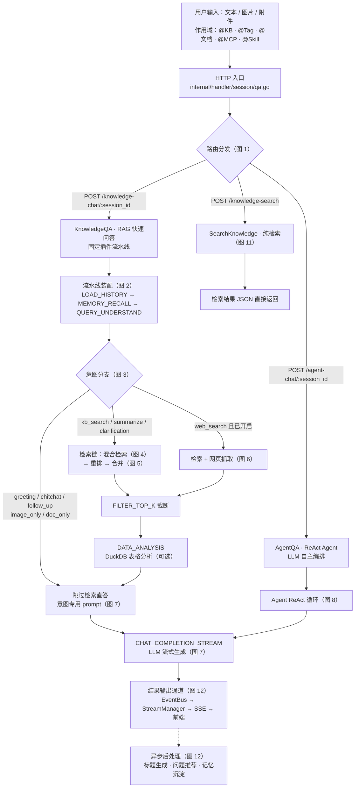

**路由全景**：三个 HTTP 端点对应三种模式——固定流水线（RAG）、LLM 自主循环（Agent）、纯召回（检索预览）。RAG 内部再按**意图**分三条支线（KB 检索 / 网页 / 直答）。两种问答模式共用同一套 SSE 输出通道。

关键文件：`internal/router/routes_chat.go`、`internal/handler/session/qa.go`。

---

## 图 1 · 入口分发路由

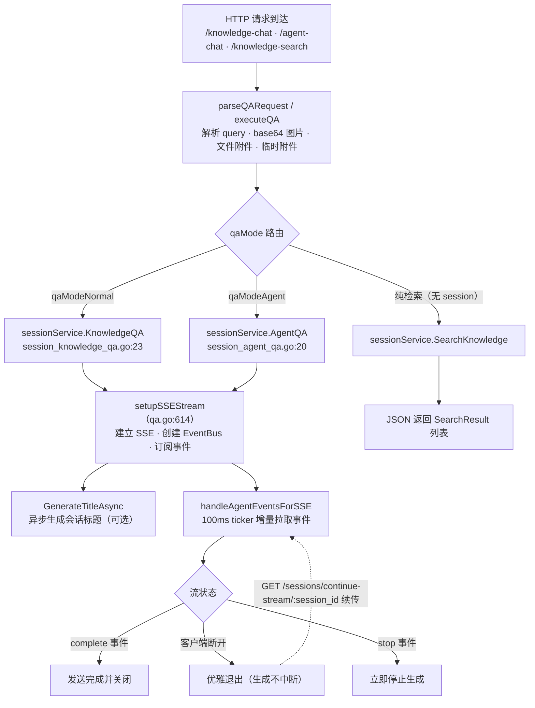

**要点**：三种入口在 handler 层统一走 `executeQA` 分发；问答类（KB/Agent）都会建立 SSE 长连接，检索预览直接返回 JSON；停止/续传是两条旁路（`StopSession` / `ContinueStream`）。

关键文件：`internal/handler/session/qa.go`、`internal/handler/session/stream.go`。深度文档：《问答SSE流式传输与前端实时渲染》。

---

## 图 2 · RAG 快速问答流水线（KnowledgeQA 路由）

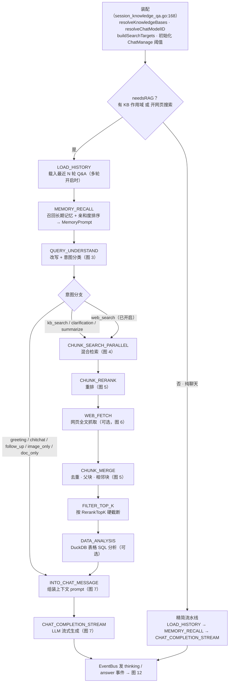

**要点**：阶段列表是**固定顺序的动态装配**（`PipelineBuilder.AddIf`），每个阶段由插件经 `EventManager` 责任链执行；`needsRAG=false`（纯聊天）时整个检索链不存在；意图只影响「检索是否真跑」，不影响阶段顺序。

关键文件：`internal/application/service/session_knowledge_qa.go`（装配）、`internal/types/chat_manage.go`（`EventType`/`PipelineBuilder`）、`internal/application/service/chat_pipeline/`（各插件）。深度文档：《问题检索与QA回答流程》§3、《多轮对话与用户记忆机制》§2.2。

---

## 图 3 · 意图识别决策树（QUERY_UNDERSTAND 内部路由）

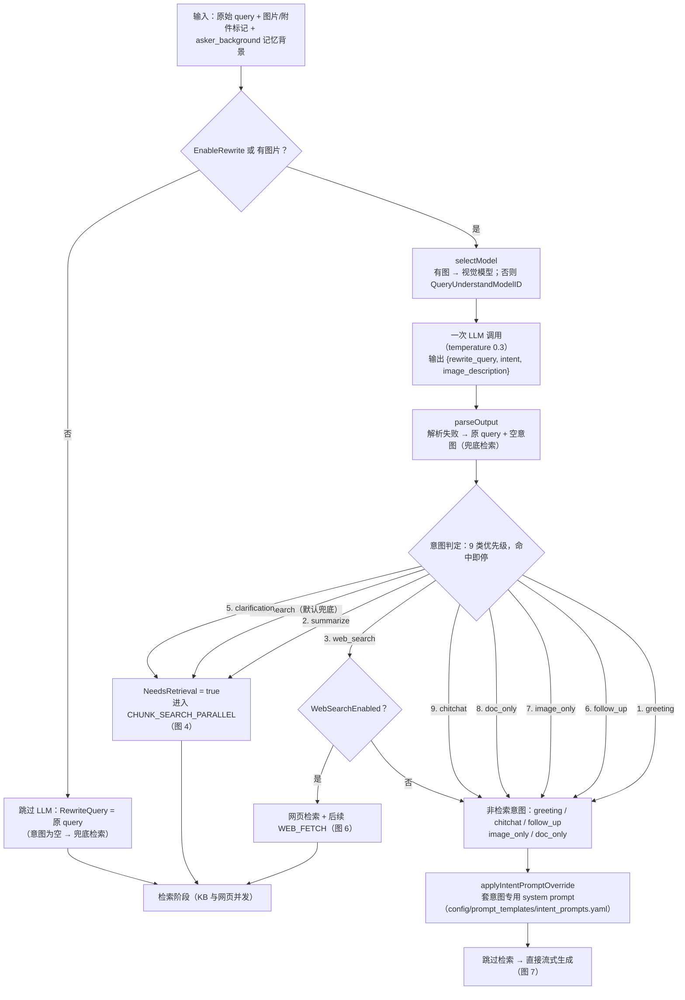

**要点**：改写与意图分类是**同一个低温度 LLM 调用**；`NeedsRetrieval()` 是后续插件跳不跳检索的判据；不确定时一律兜底 `kb_search`（宁多检索不漏）。

关键文件：`internal/application/service/chat_pipeline/query_understand.go`、`internal/types/chat_manage.go:86`、`config/prompt_templates/rewrite.yaml`。深度文档：《意图识别与查询改写》。

---

## 图 4 · 混合检索（CHUNK_SEARCH_PARALLEL 内部）

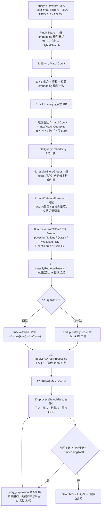

**要点**：核心是「向量 + 关键词」双路召回 + **RRF 融合**；过度召回 5 倍候选池交给重排裁剪；多引擎 fan-out 对上层透明；低召回时本地规则查询扩展兜底。

关键文件：`internal/application/service/knowledgebase_search.go`、`knowledgebase_search_fusion.go`、`knowledgebase_search_storegroup.go`、`knowledgebase_search_fanout.go`。深度文档：《问题检索与QA回答流程》§4、《检索质量深度剖析》、《存储方案与检索引擎架构》。

---

## 图 5 · 重排 → 合并 → TopK 截断

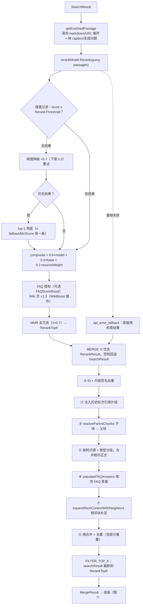

**要点**：重排有三级兜底（降级重试 → top-1 → 直用检索结果），保证流水线不断；合并阶段做「补全上下文」（父块/相邻块/FAQ 答案），最终送入 LLM 的数量由 `RerankTopK` 硬收敛。

关键文件：`internal/application/service/chat_pipeline/rerank.go`、`merge.go`、`filter_top_k.go`、`wiki_boost.go`。深度文档：《问题检索与QA回答流程》§5-6、《检索质量深度剖析》。

---

## 图 6 · 网页搜索路由

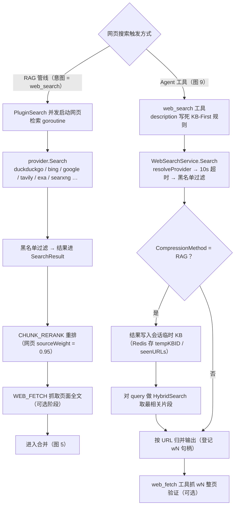

**要点**：两条路由最终都汇入重排/合并；Agent 侧的特色是 **RAG 压缩**——把网页结果灌进会话级临时 KB 再检索，只回最相关片段；KB-First（先查内部知识库再联网）靠工具 description 约束而非代码强制。

关键文件：`internal/application/service/chat_pipeline/search.go`、`web_fetch.go`；`internal/agent/tools/web_search.go`、`web_fetch.go`；`internal/application/service/web_search.go`；`internal/infrastructure/web_search/`。深度文档：《Agent工具集与工具调用机制》§7.1。

---

## 图 7 · 上下文组装与流式生成

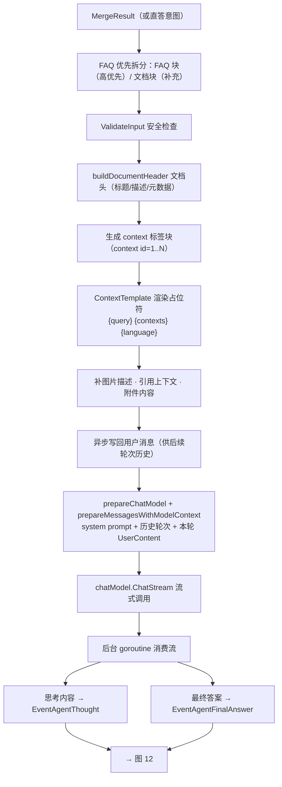

**要点**：检索到的分块被渲染进 `<documents>`/`<context>` 标签块，经 `ContextTemplate` 拼成最终用户消息；系统消息 = system prompt + 历史 Q&A 对 + 长期记忆；生成侧把「思考」与「答案」分两条事件流送出。

关键文件：`internal/application/service/chat_pipeline/into_chat_message.go`、`chat_completion_stream.go`、`common.go`。深度文档：《问题检索与QA回答流程》§7、《多轮对话与用户记忆机制》§2.5。

---

## 图 8 · ReAct Agent 循环（AgentQA 路由）

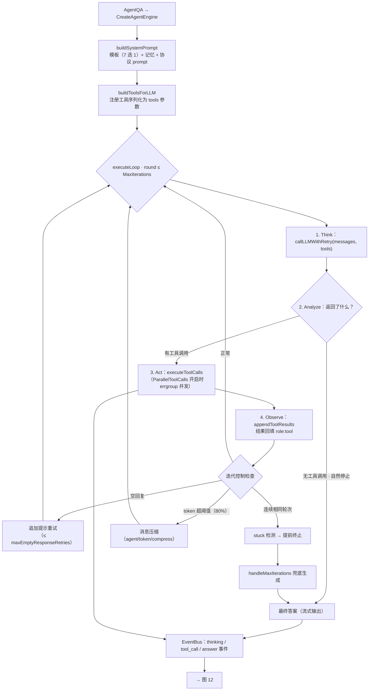

**要点**：与固定流水线相反，Agent 路径的每一步都由 LLM 决策；结束条件是「纯文本 + 自然停止」；有卡死检测、空回复重试、上下文压缩、迭代上限兜底四层保护；系统提示词按 mode/预置 Agent 路由（见《Agent工具集与工具调用机制》§9.2）。

关键文件：`internal/agent/engine.go`、`internal/agent/act.go`、`internal/agent/prompts.go`、`internal/application/service/session_agent_qa.go`。深度文档：《Agent工具集与工具调用机制》§2、《Agent处理过程记录与前端实时显示》。

---

## 图 9 · 工具调用生命周期与工具路由

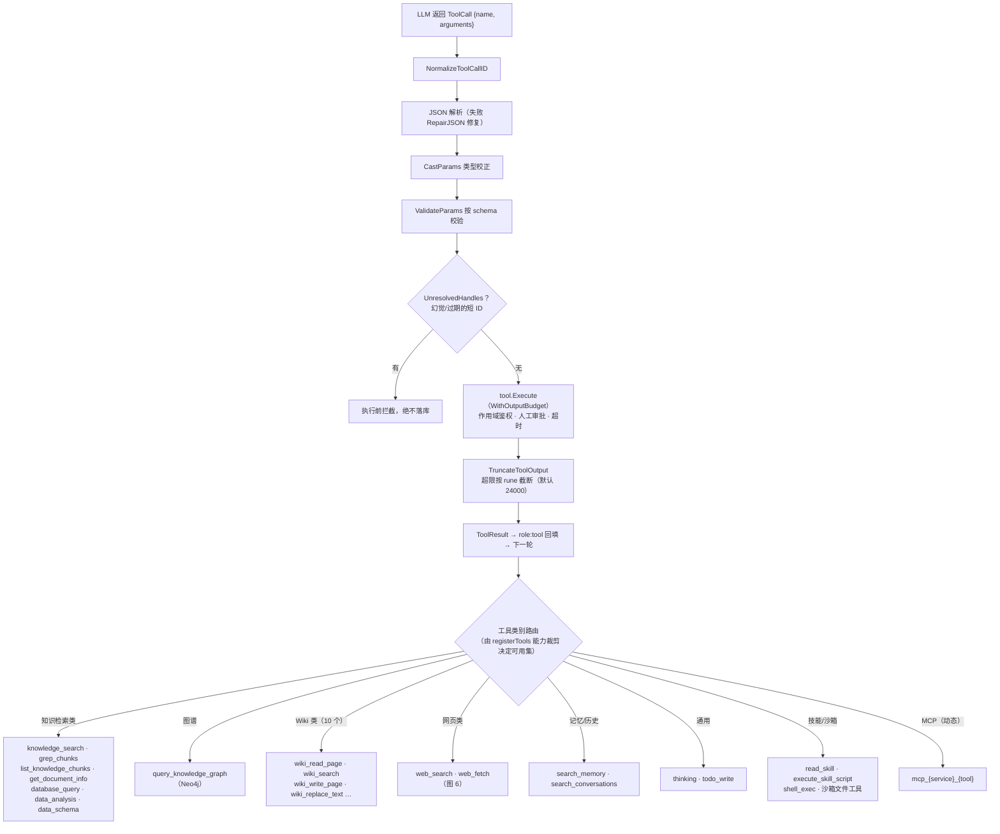

**要点**：工具选择由 LLM 的 function calling 决定，后端只负责「给清单、执行、回填」；执行前有一串防御（JSON 修复、类型校正、schema 校验、短 ID 拦截）；工具集按会话作用域动态裁剪（无 Wiki KB 不注册 Wiki 工具等）；每类工具的详细分诊规则见各工具 description。

关键文件：`internal/agent/tools/registry.go`、`act.go`、`param_validate.go`、`scope_authorization.go`、`internal/application/service/agent_service.go`（`registerTools`）。深度文档：《Agent工具集与工具调用机制》§3-7。

---

## 图 10 · RAG 知识库 vs Wiki 触发路由

「什么时候查 RAG 知识库（chunk 级检索）、什么时候读 Wiki（页面级蒸馏知识）」是两条路径里共有的核心路由问题，一张图看全：

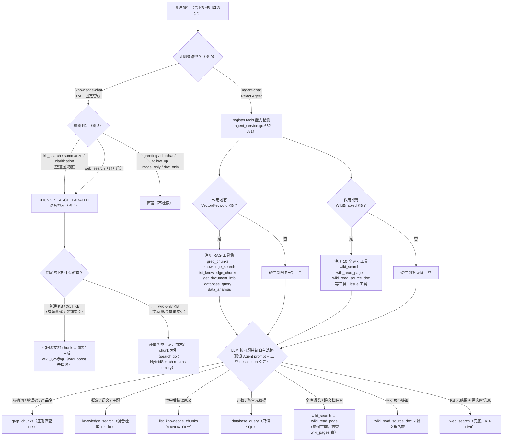

（工具执行细节见图 9，工具类别裁剪规则见图 9 下方说明。）

### 分诊表：问题特征 → 检索表面

| 问题特征 | 工具 | 表面 | 粒度 |
| --- | --- | --- | --- |
| 精确标识符 / 错误码 / 产品名 / 专有名词 | `grep_chunks` | RAG chunk（DB 正则） | chunk |
| 概念解释 / 主题概览 / how-why / 同义表达 | `knowledge_search` | RAG chunk（向量 + 关键词 + RRF） | chunk |
| 已命中后需要完整上下文 | `list_knowledge_chunks` | RAG chunk（原文分页精读） | chunk / 文档 |
| 「库里多少文档、各状态分布」等聚合 | `database_query` | 元数据库（只读 SQL） | 表级 |
| 表格统计 / 求和 / 分组 / 趋势 | `data_analysis` | DuckDB 沙箱 | 表级 |
| A 和 B 什么关系（图谱开启） | `query_knowledge_graph` | Neo4j 图谱 | 实体级 |
| 全库概览 / 有哪些实体主题 / 跨文档综合 | `wiki_search` → `wiki_read_page` | Wiki 页面（直查 Postgres） | 页面 |
| Wiki 页不够细、要回原始证据 | `wiki_read_source_doc` | 源文档 chunk | chunk |
| KB 无结果 + 实时/外部信息 | `web_search`（兜底） | 外部网页 | 页面 |

### 预设 Agent 的路由

| 预设 | 适用场景 | 工具面 | 提示词核心 |
| --- | --- | --- | --- |
| `progressive_rag_agent`（默认） | 只绑普通 KB | RAG 工具集 | Strict Sequence：grep → search → list（MANDATORY）→ graph（可选）→ web（兜底） |
| `wiki_researcher`（维基问答） | 只绑 wiki KB | 只读 wiki 工具 + `wiki_flag_issue` | Search-Read-Expand 循环 |
| `hybrid_rag_wiki_agent`（混合） | 同时绑 wiki KB 和普通 KB | RAG + Wiki 双工具集 | `WIKI_KBS` / `CHUNK_KBS` 分区，明示哪些 KB 走页面、哪些走 chunk |
| `wiki_fixer`（维基修订） | 修复 wiki 问题 | 全量写工具 | 先读 issue 再定修复策略，一轮改完 |

### 全绑定场景（绑定所有 KB + 所有工具）：裁决权交给 LLM

当 `KBSelectionMode=all` 且工具全开时，上图两个硬闸门（RAG 工具 / wiki 工具）**全部放行**——此后没有任何代码级 if/else 再裁决「走 RAG 还是走 wiki」，决策由 LLM 依三层信息作出：

1. **系统提示词（决定性因素）**：
   - 默认 `progressive_rag_agent`：Strict Sequence 只编排 RAG 工具链，**不提 wiki 工具**——wiki 工具虽注册但实际闲置（LLM 只能靠 description 自悟，无确定性保证）；
   - `hybrid_rag_wiki_agent`：为全绑定场景设计的显式路由规则（`agent_system_prompt.yaml`）：
     - 读 `<bound_knowledge_bases>` 的 `capabilities` 属性构造两个内部路由变量——含 `wiki` → 归入 `WIKI_KBS`，含 `chunks` → 归入 `CHUNK_KBS`；
     - **概念性 / 关系性 / 是什么 / 怎么工作 → 优先 wiki**（`WIKI_KBS` 非空时），否则退回 chunks；
     - **具体事实 / 精确引用 / 数字 / 代码级 → 优先 chunks**（`CHUNK_KBS` 非空时），否则退回 wiki；
     - 交叉兜底：chunks 第一轮无结果且 wiki 可用 → 回 wiki 再搜；并禁止把 `capabilities`、`wiki-only` 等内部机制泄露给用户；
   - `wiki_researcher`：Wiki First 绝对规则——凡 wiki 可能覆盖的领域事实必须先查 wiki。
2. **运行时 `capabilities` 属性**：每个绑定 KB 以 `capabilities="wiki,chunks"` 标签进 `<bound_knowledge_bases>`（`prompts.go` 的 `formatKnowledgeBaseList`）；双开 KB 两标签都有、同时出现在两个分区，LLM 按问题性质在同一库的两种表面间选。
3. **工具 description（兜底信号）**：提示词无显式规则时，这是 LLM 唯一的分诊依据——软引导，非保证。

结论：**「何时走 RAG、何时走 Wiki」在全绑定场景下不是系统硬规则，而是 prompt 设计问题**——这正是预置 Agent 类型（`agent_type`）存在的意义：用「推荐的提示词 + 工具白名单 + KB 兼容性提示」打包，在自由度最高的场景下给出确定的路由策略。另外这一切只发生在 smart-reasoning 模式；quick-answer 模式无论绑定多少库，固定管线永远只走 chunk 检索，wiki 页不参与。

### 边界与现状（容易踩坑的地方）

1. **RAG 固定管线从不读 wiki 页**：`/knowledge-chat` 下 wiki 页不参与任何环节；`wiki_boost`（×1.3 重排加权）预埋了「wiki 页进检索」的通道，但创建侧未实现（`wp-` chunk 从没被创建过），实际不触发。
2. **wiki-only KB 在 RAG 管线下检索为空**：`search.go:326-340` 注释明确 wiki/graph-only KB 无向量或关键词索引可降级，HybridSearch 空手而归——这类 KB 只能靠 Agent 的 wiki 工具消费。
3. **双开 KB 有两套表面**：同一 KB 既开 wiki 又开向量/关键词时，源 chunk 与蒸馏页面并存——LLM 靠工具 description 与 `hybrid_rag_wiki_agent` 的分区提示在两者间选路。
4. **问题推荐的 wiki 来源**：答案生成后，开场/追问推荐问题可能从 wiki 页面生成（来源集：精选/FAQ/文档/Wiki/LLM），与问答检索是两条独立通道。

关键文件：`internal/application/service/agent_service.go`（`registerTools` 能力检测与硬性裁剪）、`internal/application/service/chat_pipeline/search.go`（wiki-only 边界）、`chat_pipeline/wiki_boost.go`（未接线的加权）、`internal/agent/tools/wiki_tools.go`、`grep_chunks.go`、`knowledge_search.go`。深度文档：《Agent工具集与工具调用机制》§3、§5-6、《LLM Wiki知识库生成与使用逻辑》§7。

---

## 图 11 · 纯检索 API（SearchKnowledge 路由）

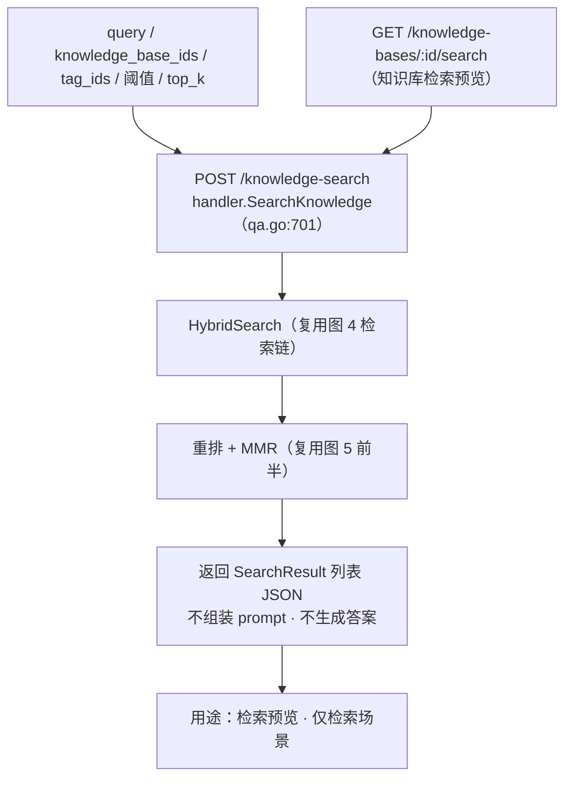

**要点**：与问答共用同一条检索实现，但没有 `QUERY_UNDERSTAND`、`MERGE`、生成与 SSE；结果是纯 JSON。

关键文件：`internal/handler/session/qa.go`（`SearchKnowledge`）、`internal/router/routes_knowledge.go:121`。

---

## 图 12 · 输出通道与后处理

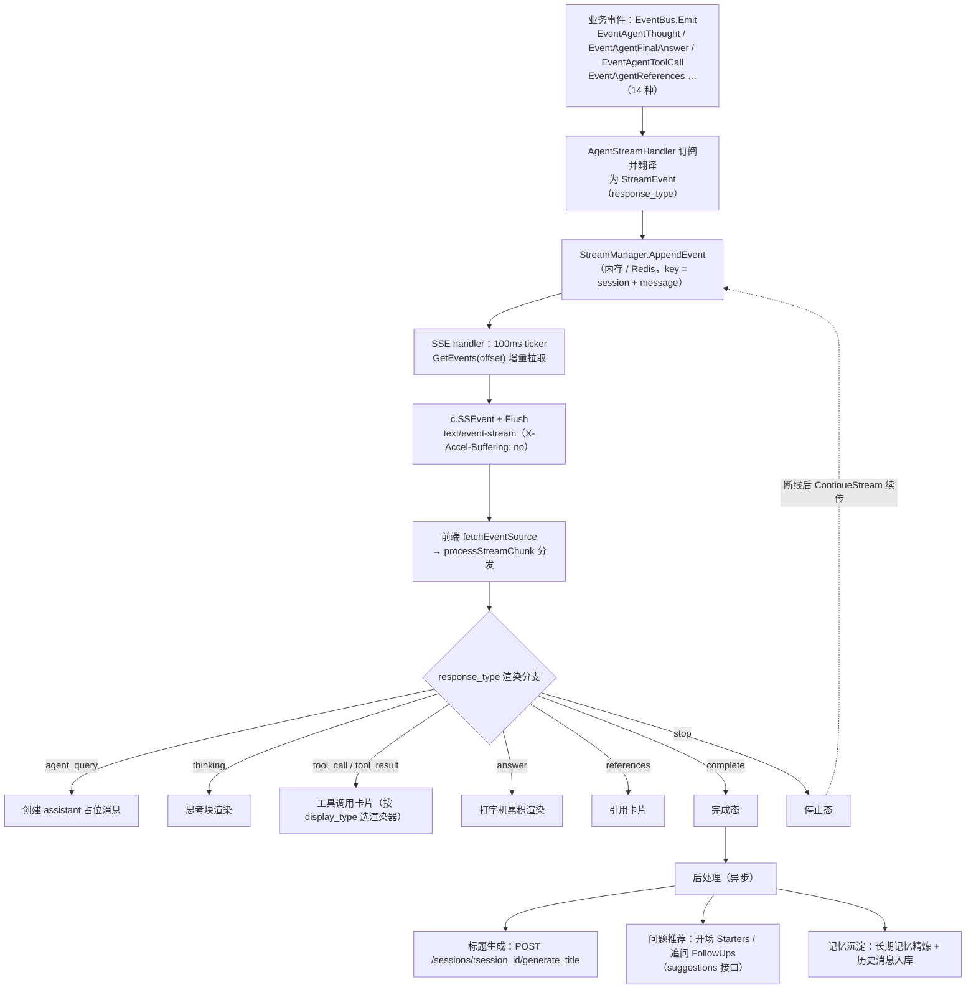

**要点**：事件链三层解耦（EventBus → StreamManager → SSE 轮询），支持断线续传与分布式部署；RAG 与 Agent 模式在前端是**同一套 SSE 协议**，仅渲染分支不同；标题、推荐、记忆沉淀都发生在答案之后、异步执行。

关键文件：`internal/handler/session/agent_stream_handler.go`、`stream.go`、`internal/stream/`；前端 `frontend/src/api/chat/streame.ts`、`frontend/src/composables/useChatStreamHandler.ts`。深度文档：《问答SSE流式传输与前端实时渲染》、《问题推荐生成与使用逻辑》、《多轮对话与用户记忆机制》§3。

---

## 关键文件索引

| 关注点 | 文件 |
| --- | --- |
| 路由注册（三端点） | `internal/router/routes_chat.go` |
| HTTP 入口 / 分发 / SSE 建立 | `internal/handler/session/qa.go`、`stream.go`、`agent_stream_handler.go` |
| RAG 服务入口 + 流水线装配 | `internal/application/service/session_knowledge_qa.go` |
| Agent 服务入口 | `internal/application/service/session_agent_qa.go` |
| 流水线框架（Plugin / EventManager） | `internal/application/service/chat_pipeline/chat_pipeline.go` |
| 阶段枚举 / ChatManage / PipelineBuilder | `internal/types/chat_manage.go` |
| 查询理解（改写 + 意图） | `internal/application/service/chat_pipeline/query_understand.go` |
| 混合检索 + RRF 融合 | `internal/application/service/knowledgebase_search.go`、`knowledgebase_search_fusion.go` |
| 重排 / 合并 / 截断 | `internal/application/service/chat_pipeline/rerank.go`、`merge.go`、`filter_top_k.go` |
| 上下文组装 / 流式生成 | `internal/application/service/chat_pipeline/into_chat_message.go`、`chat_completion_stream.go` |
| ReAct 引擎 / 工具执行 | `internal/agent/engine.go`、`internal/agent/act.go` |
| 工具注册与能力裁剪 | `internal/application/service/agent_service.go`（`registerTools`） |
| 网页搜索（管线插件 / 工具 / 服务 / provider） | `chat_pipeline/web_fetch.go`、`agent/tools/web_search.go`、`application/service/web_search.go`、`infrastructure/web_search/` |
| 事件存储与重放 | `internal/stream/`（`memory_manager.go` / `redis_manager.go`） |
| 前端流式消费 | `frontend/src/api/chat/streame.ts`、`frontend/src/composables/useChatStreamHandler.ts` |
