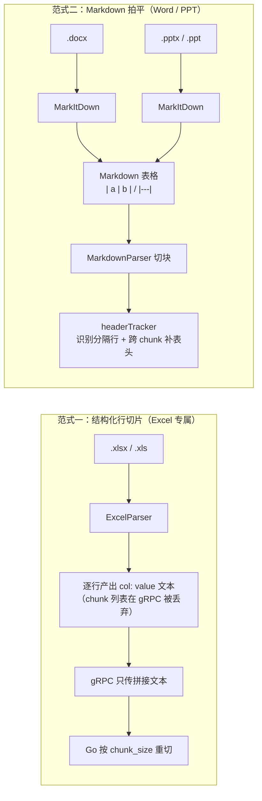

# WeKnora 表格切片与表头识别

> 本文回答：**Excel / Word / PPT / Markdown 中的表格，分别是怎么被切片成 chunk 的，表头又是怎么识别的**。
>
> 核心结论：WeKnora 对表格的处理分成**两种互不相干的范式**——
>
> - **Excel**：在 Python docreader 里**按行产出 `列: 值` 键值对**（解析器内部逐行建 chunk，但 gRPC 只传拼接文本、Go 侧再按 `chunk_size` 重切）；表头是「列字母」或「可开关的首行语义表头」，以 `key:` 前缀内嵌进每一行；
> - **Word / PPT**：先用 MarkItDown 把文档**拍平成 Markdown 表格文本**，再走通用文本切块，表头靠「分隔行 `|---|`」正则识别，跨 chunk 时由 `headerTracker` 重新注入表头。
>
> 代码基准：`docreader/parser/`（Python 解析器）+ `docreader/splitter/`（Python 切块）+ `internal/infrastructure/chunker/`（Go 切块）。

---

> ⚠️ **别把「表格切片」和「父子块」混为一谈**——二者是两套完全独立、互不相干的机制，只是名字里都带「块」：
>
> - **父子块**（Parent-Child chunking，`ChunkingConfig.EnableParentChild`）是**分块层**的概念，作用在「统一 Markdown 中间态」上，**与格式无关**。父块（默认 4096）提供上下文、子块（默认 384）做向量匹配。**任何格式**（含 xlsx）解析成 Markdown 后，只要 KB 开了开关就统一走 `chunker.SplitParentChild`（`knowledge_process.go:3533`），没有按 `fileType` 的特判。
> - **表格切片 / 表头识别**是**解析层**的概念，与格式强相关——xlsx 走「行级结构化切片」，Word/PPT 走「Markdown 拍平 + 表头追踪」。这才是本文的主体。
>
> 所以「**xlsx 解析走不走父子块**」要分两层答：**解析层不走**（走行级切片，见 §3）；**分块层走**，但仅当 `EnableParentChild=true`，且和其他格式一视同仁。详见《文本解析分块详解.md》§6。

---

## 目录

1. [两种表格处理范式总览](#1-两种表格处理范式总览)
2. [三种格式一句话对照](#2-三种格式一句话对照)
3. [Excel：行级结构化切片](#3-excel行级结构化切片)
4. [Word：MarkItDown 优先，python-docx 兜底](#4-wordmarkitdown-优先python-docx-兜底)
5. [PPT：MarkItDown + LibreOffice](#5-pptmarkitdown--libreoffice)
6. [Markdown 表格：表头识别与跨 chunk 补全](#6-markdown-表格表头识别与跨-chunk-补全)
7. [附：关键文件索引](#7-附关键文件索引)

---

## 1. 两种表格处理范式总览



- **范式一**（Excel）：表格本身就是结构化数据源，解析器**按行**产出 `key: value` 文本；但解析器内部那份「一行一个 chunk」在 gRPC 边界被丢弃，Go 侧拿到拼接文本后**按 `chunk_size` 重切**，所以一个 chunk 通常是若干行。表头不是独立块，而是每行的 `key:` 前缀，不需要「表头追踪」。
- **范式二**（Word/PPT）：表格只是文档里的一个块，先被 MarkItDown 转成 Markdown 表格**文本**，随后和普通段落一样被切块；切块可能把一个表格拦腰截断，所以需要额外的表头识别 + 重注入机制来保上下文。

两者唯一的交汇点是「Excel 在 Go 侧的表格摘要」——见 §3.4，它是 Excel 特有的下游增强，与 Word/PPT 无关。

---

## 2. 三种格式一句话对照

| 格式 | 解析路由 | 表格最终形态 | 表头识别 | 切片粒度 |
| --- | --- | --- | --- | --- |
| **Excel** | `ExcelParser` | `列: 值` 键值对 | 列字母（默认）/ 首行语义表头（开关） | Go 按 chunk_size 重切（若干行一个 chunk） |
| **Word** | `Docx2Parser`（MarkItDown 优先） | Markdown 表格 | 分隔行正则（表头行 + `---` 行） | 文本切块 + headerTracker 补表头 |
| **PPT** | `MarkitdownParser` | Markdown 表格 | 分隔行正则（表头行 + `---` 行） | 文本切块 + headerTracker 补表头 |
| **Markdown** | `MarkdownParser` | Markdown 表格（原样） | 分隔行正则（表头行 + `---` 行） | 文本切块 + headerTracker 补表头 |

---

## 3. Excel：行级结构化切片

解析主体是 `docreader/parser/excel_parser.py` 的 `ExcelParser`。核心方法 `parse_into_text`（`excel_parser.py:78`）：

```text
读文件字节
  │
  ├─ xlsx_repair.repair_xlsx_bytes()      修复损坏 xlsx
  ├─ excel_convert.convert_excel_to_xlsx_bytes()  旧 .xls → .xlsx（LibreOffice/engine）
  ├─ xlsx_merge.fill_merged_cells_xlsx()  填充合并单元格
  ▼
pandas 读 DataFrame（header=None，不自动识别表头）
  │
  ├─ df.dropna(how="all")                 丢弃全空行
  ▼
逐行遍历 → 每行组装 "col: value"
  │
  ├─ content = "".join(text)              所有行用 \n 拼成一段文本
  └─ chunks = [每行一个]                  仅 Python 内部，gRPC 不传
  ▼
gRPC 只传 content（main.py:206）
  ▼
Go chunker.Split(content, chunk_size)     按 chunk_size 重切 → 若干行一个 chunk
```

### 3.1 逐行产出 + gRPC 丢弃 chunks（端到端并非「一行一个 chunk」）

`parse_into_text` 对每行遍历单元格，拼成逗号分隔的键值对（`excel_parser.py:110-131`），**同时**做了两件事：

```python
content_row = ",".join(page_content) + "\n"
chunks.append(Chunk(content=content_row, seq=len(chunks), start=start, end=end))  # 每行一个 chunk
...
return Document(content="".join(text), chunks=chunks)   # excel_parser.py:134
```

一行 `姓名 | 年龄 | 城市`、`张三 | 30 | 上海`，每行文本是：

```text
A: 姓名,B: 年龄,C: 城市
A: 张三,B: 30,C: 上海
```

**关键**：`chunks`（每行一个）**过不了 gRPC**——`docreader.proto` 没有 chunks 字段，`main.py:206` 只序列化 `markdown_content=_c(result.content)`。Go 侧拿到的是所有行用 `\n` 拼成的一段文本，然后 `chunker.Split` 按 `chunk_size` 重新切块（`knowledge_process.go:3555`）。所以端到端里**一个 chunk = 按 chunk_size 攒起来的若干行**，并非一行一个 chunk。

三个细节：

- **空行丢弃**：先 `df.dropna(how="all")`（`excel_parser.py:108`）。
- **空单元格跳过**：`pd.notna(v)` 为假的不进 `page_content`，所以一个 chunk 里列数不固定（`excel_parser.py:115`）。
- **图片函数跳过**：WPS 用 `=DISPIMG("ID",mode)`、Office 365 用 `=_xlfn.IMAGE(url,...)` 内嵌图片，被 `_IMAGE_FUNC_RE`（`excel_parser.py:33`）识别后 `_is_image_function` 排除出文本（`excel_parser.py:38`）。

### 3.2 合并单元格先展开

`docreader/parser/xlsx_merge.py` 的 `fill_merged_cells_xlsx`（`xlsx_merge.py:12`）在 pandas 读之前，把合并区左上角 master 值复制到覆盖的每个单元格。openpyxl 只把值存在左上角，pandas 读到其余位置是 NaN；填充后每行 chunk 才能保留完整上下文。

### 3.3 表头识别：列字母 vs 首行语义表头

由开关 `xlsx_first_row_as_header` 决定，见 `_read_sheet_dataframe`（`excel_parser.py:137`）：

| 配置 | 表头行为 |
| --- | --- |
| `false`（默认） | 列名用**列字母** A/B/C…（`get_column_letter`），第 1 行**当作普通数据**一起切片 |
| `true` | 第 1 行**提升为语义表头**，用 `_stable_header_labels` 规范化（`excel_parser.py:157`） |

`_stable_header_labels` 的清洗规则：

- 表头为空 → 回退成列字母；
- 表头重复 → 加 `_2` 后缀（第二个 `名称` → `名称_2`），避免 key 冲突。

**开关的配置来源**（Go 侧）：

- 类型定义：`internal/types/knowledgebase.go:240` 的 `ParserEngineRule.XLSXFirstRowAsHeader *bool`；
- 覆盖项键名：`internal/application/service/knowledge_process_config.go:13` 的 `xlsx_first_row_as_header`。

### 3.4 表头是否进 chunk / 参与 embedding

表头**不是一个独立 chunk，也不是独立的一行**，而是作为 `key:` 前缀内嵌在每一行的文本里：

- 默认（列字母表头）：每行是 `A: 张三,B: 30,C: 上海`，`A`/`B`/`C` 就是「表头」；
- 开 `xlsx_first_row_as_header`：每行是 `姓名: 张三,年龄: 30,城市: 上海`，语义表头直接写进 key。

所以表头**会进 chunk、也参与 embedding**——key 和 value 是同一个字符串，随行一起进 Go 重切出的 chunk，再作为 chunk body 整体被嵌入。

embedding 的最终输入是 `buildKnowledgeIndexContent(knowledge, chunk.EmbeddingContent())`：

- `EmbeddingContent()` = `ContextHeader + "\n\n" + body`（`internal/types/chunk.go:202`）——Excel 没有 Markdown 标题，`ContextHeader` 为空；
- `buildKnowledgeIndexContent` 只在最前面加**文档标题**（`knowledge_index_content.go`）。

一个 Excel chunk 的 embedding 文本 ≈：

```text
文档标题
A: 张三,B: 30,C: 上海
A: 李四,B: 25,C: 北京
...（若干行）
```

### 3.5 下游增强：表格摘要（仅 Excel）

Excel 解析出的行级文本之外，Go 侧还有一层独立的表格增强——`DataTableSummaryService`（详见《不同格式文档处理流程》§5）：

- 用 DuckDB 加载表格，取样本数据；
- LLM 生成**表格摘要**（表名/核心字段/数据规模/业务场景）和**列描述**；
- 生成 `table_summary` + `table_column` 两个 chunk 建索引，支持「表格检索」和 `DATA_ANALYSIS`（DuckDB SQL 分析）。

Word/PPT 的表格**没有**这一层，因为它们被拍平成 Markdown 文本，不再是结构化表。

---

## 4. Word：MarkItDown 优先，python-docx 兜底

### 4.1 路由：FirstParser 链

`registry.py:131` 把 `.docx` 映射到 `Docx2Parser`；`Docx2Parser` 是 `FirstParser`（`docx2_parser.py:11`）：

```python
class Docx2Parser(FirstParser):
    _parser_cls = (MarkitdownParser, DocxParser)   # MarkItDown 优先，DocxParser 兜底
```

`FirstParser.parse_into_text`（`chain_parser.py:48`）按顺序尝试，第一个返回 `is_valid()` 的解析器胜出。所以**正常情况下走 MarkItDown**，只有 MarkItDown 失败才回退到 python-docx 的 `DocxParser`。

> 注意：《不同格式文档处理流程》§3.1 里写的是「先试 DocxParser，失败回退 MarkItDown」，与代码相反，以此文档为准。

### 4.2 主路径：MarkItDown → Markdown 表格

`MarkitdownParser = PipelineParser(StdMarkitdownParser, MarkdownParser)`（`markitdown_parser.py:82`）。

`StdMarkitdownParser.parse_into_text`（`markitdown_parser.py:35`）对 docx：

1. `fill_vertical_merged_cells_docx(content)` 先填充**纵向合并单元格**（`markitdown_parser.py:48`，实现见 `docx_merge.py`）；
2. MarkItDown 把 docx 转成 Markdown——**表格就是标准 Markdown 表格**（`| 表头 |` + `|---|`）；
3. 交给 `MarkdownParser` 切块，走 §6 的 Markdown 表格表头追踪。

### 4.3 兜底路径：python-docx（表格处理较弱）

只有 MarkItDown 失败才到 `DocxParser`（`docx_parser.py`），它的表格处理是**另一套、且更弱**：

- `_convert_table_to_html` 把表格转成 `<table><tr><td colspan=...>` HTML，合并单元格用 `colspan` 近似（`docx_parser.py:1055`）；
- 但主路径 `parse_into_text` 里这个 HTML `tables` 返回值**实际被丢弃**（只消费了段落 `all_lines`，`docx_parser.py:145` 起）；
- 只有更深一层的 `_parse_using_simple_method` 会把表格行以 `" | ".join(cell.text...)` 形式保留（`docx_parser.py:243-268`）。

也就是说：python-docx 兜底路径下，表格要么被转成 HTML 后丢弃，要么退化成 `|` 连接的纯文本行，**没有** MarkItDown 路径那样规整的 Markdown 表格和表头追踪。

---

## 5. PPT：MarkItDown + LibreOffice

`registry.py:138-139` 把 `.pptx`/`.ppt` 都映射到 `MarkitdownParser`。

`StdMarkitdownParser.parse_into_text`（`markitdown_parser.py:35`）对 ppt：

1. `normalize_ppt_bytes(content, ft)`：旧版 `.ppt`（OLE 二进制）先用 LibreOffice（`soffice`）转成 `.pptx`（`markitdown_parser.py:44`，实现见 `ppt_convert.py`）；
2. MarkItDown 把 pptx 转成 Markdown——幻灯片里的表格同样变成 Markdown 表格；
3. `attach_pptx_media_to_markdown` 把 PPT 里的图片等媒体回挂到 Markdown（`markitdown_parser.py:63-64`，实现见 `pptx_media.py`）；
4. 交给 `MarkdownParser` 切块，走 §6 的 Markdown 表格表头追踪。

PPT 的表格处理和 Word 完全同构：**没有行级结构化切片，就是 Markdown 拍平 + 通用切块 + 表头重注入**。

---

## 6. Markdown 表格：表头识别与跨 chunk 补全

Word/PPT 汇入 Markdown 之后，以及用户直接上传的 `.md`，表格都走同一套切块逻辑。关键在于：**一个大表格可能被拦腰切成多个 chunk，后段会丢掉表头**，所以需要「表头识别 + 跨 chunk 重注入」。

这套逻辑在 Go 侧 `internal/infrastructure/chunker/header_tracker.go`，其 Python 双胞胎在 `docreader/splitter/header_hook.py`。

### 6.1 表头识别：分隔行正则

表头 = 「表头行 + 分隔行」两行，被正则匹配，优先级 `markdownTableHookPriority = 15`（`header_tracker.go:40`）：

```go
// header_tracker.go:26-34
startPattern: regexp.MustCompile(`(?si)^\s*(?:\|[^|\n]*)+[\r\n]+\s*(?:\|\s*:?-{3,}:?\s*)+\|?[\r\n]+$`),
endPattern:   regexp.MustCompile(`(?si)^\s*$|^\s*[^|\s].*$`),   // 空行或非表格行
```

匹配到的内容（表头行 + 分隔行）成为「活跃表头」，直到遇到空行 / 非表格行结束。

### 6.2 跨 chunk 补表头

`headerTracker` 维护活跃表头；当一个 Markdown 表格被切块拆散时，后续 chunk 会**在开头重新注入表头 + 分隔行**，保证每个 chunk 都有列语义：

```text
chunk 1：| 姓名 | 年龄 | 城市 |
        | --- | --- | --- |
        | 张三 | 30 | 上海 |
        | 李四 | 25 | 北京 |        ← 表格在此被切断

chunk 2：| 姓名 | 年龄 | 城市 |    ← headerTracker 重新注入的表头
        | --- | --- | --- |
        | 王五 | 28 | 深圳 |
```

### 6.3 MarkItDown 怪癖兜底

`header_hook.py` 的 `_is_empty_table_header_row` 处理一个 MarkItDown 输出怪癖：有时 MarkItDown 生成的表头行**只有管道符、列名却出现在分隔行附近**。此时按「列名行为空」判定，回退用分隔行作为表头参照，避免识别失效。

---

## 7. 附：关键文件索引

| 关注点 | 文件 |
| --- | --- |
| Excel 行级切片 / 表头识别 | `docreader/parser/excel_parser.py`（`parse_into_text:78`、`_read_sheet_dataframe:137`、`_stable_header_labels:157`） |
| Excel 合并单元格填充 | `docreader/parser/xlsx_merge.py` |
| Excel 格式修复 / .xls 转换 | `docreader/parser/xlsx_repair.py`、`excel_convert.py` |
| Excel 首行表头开关（Go 类型） | `internal/types/knowledgebase.go:240`（`ParserEngineRule.XLSXFirstRowAsHeader`） |
| Excel 首行表头覆盖项 | `internal/application/service/knowledge_process_config.go:13` |
| gRPC 只传 content（丢弃 chunks） | `docreader/main.py`（`Read:206`）、`docreader/proto/docreader.proto` |
| Go 重新切块入口 | `internal/application/service/knowledge_process.go:3555`（`chunker.Split`） |
| embedding 内容组装 | `internal/application/service/knowledge_index_content.go`、`internal/types/chunk.go`（`EmbeddingContent`） |
| Word 路由（FirstParser 链） | `docreader/parser/docx2_parser.py`、`chain_parser.py` |
| Word python-docx 兜底（HTML 表 / 简单行） | `docreader/parser/docx_parser.py`（`_convert_table_to_html:1055`、`_parse_using_simple_method:243`） |
| Word 纵向合并单元格填充 | `docreader/parser/docx_merge.py` |
| PPT 规范化 / 媒体回挂 | `docreader/parser/ppt_convert.py`、`pptx_media.py` |
| MarkItDown 统一入口 | `docreader/parser/markitdown_parser.py` |
| Markdown 表头识别 + 跨 chunk 补全（Go） | `internal/infrastructure/chunker/header_tracker.go` |
| Markdown 表头识别（Python 双胞胎） | `docreader/splitter/header_hook.py` |
| 格式 → 解析器映射 | `docreader/parser/registry.py` |
| Excel 下游表格摘要（Go） | `DataTableSummaryService`（见《不同格式文档处理流程》§5） |
